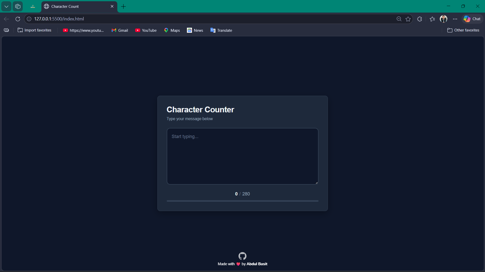
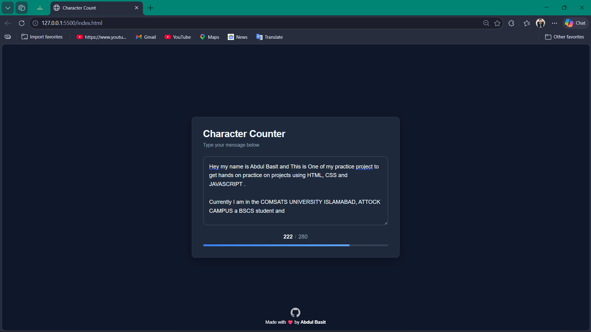
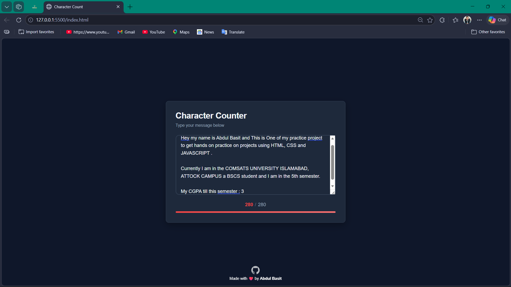
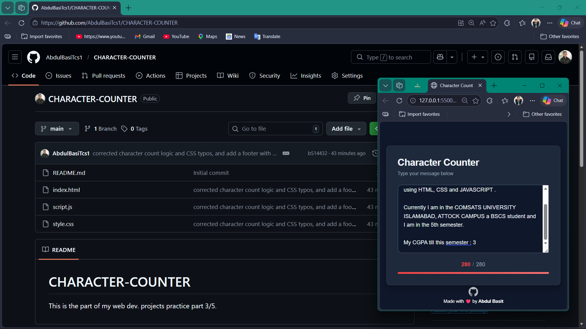

# CHARACTER-COUNTER

> This is part of my web dev. projects practice — **Project 3 of 5**.

A clean, minimal **Character Counter** web app built with **HTML**, **CSS**, and **JavaScript**. It tracks how many characters you've typed in a textarea (up to a 280-character limit) and visualizes the progress with a dynamic color-changing progress bar.

---

## 🚀 Features

- Real-time character count as you type
- Dynamic progress bar that fills as you approach the limit
- Color changes to **red** when the character limit (280) is reached
- GitHub footer link
- Dark, modern UI

---

## 🛠️ Tech Stack

| Technology | Usage |
|------------|-------|
| HTML5 | Structure |
| CSS3 | Styling & animations |
| JavaScript | Live counter logic |

---

## 📸 Screenshots

### 1. Initial State — Empty textarea (0 / 280)


---

### 2. In Progress — Typing with progress bar filling (222 / 280)


---

### 3. Limit Reached — Counter and bar turn red (280 / 280)


---

### 4. Live Demo & GitHub Repo Side-by-Side


---

## 📂 Project Structure

```
CHARACTER-COUNTER-1/
├── index.html          # Main HTML structure
├── style.css           # Styling and layout
├── script.js           # Character counter logic
├── ScreenShot1.png     # Empty state screenshot
├── ScreenShot2.png     # Mid-typing screenshot
├── ScreenShot3.png     # Limit reached screenshot
├── ScreenShot4.png     # GitHub + Live app screenshot
└── DEMO_Character-Counter.mp4  # Demo video
```

---

## ▶️ How to Run

1. Clone the repository:
   ```bash
   git clone https://github.com/AbdulBasiTcs1/CHARACTER-COUNTER.git
   ```
2. Open `index.html` in your browser — no build step or dependencies needed.

---

## 👨‍💻 Author

**Abdul Basit** — BSCS Student @ COMSATS University Islamabad, Attock Campus

[](https://github.com/AbdulBasiTcs1)
